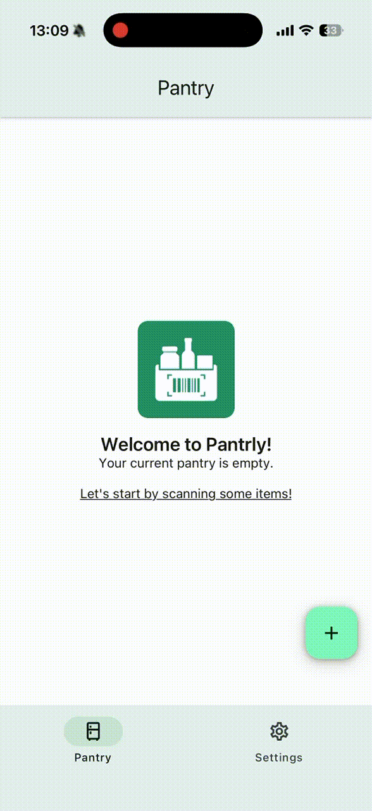
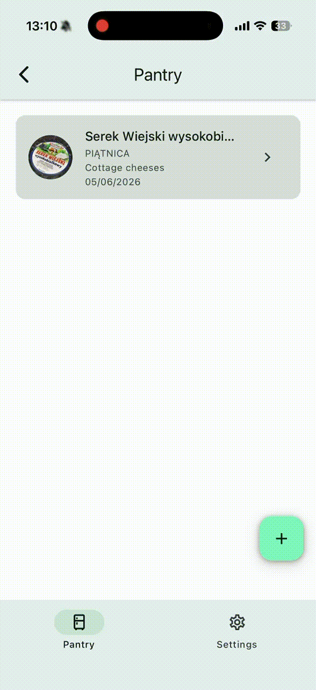
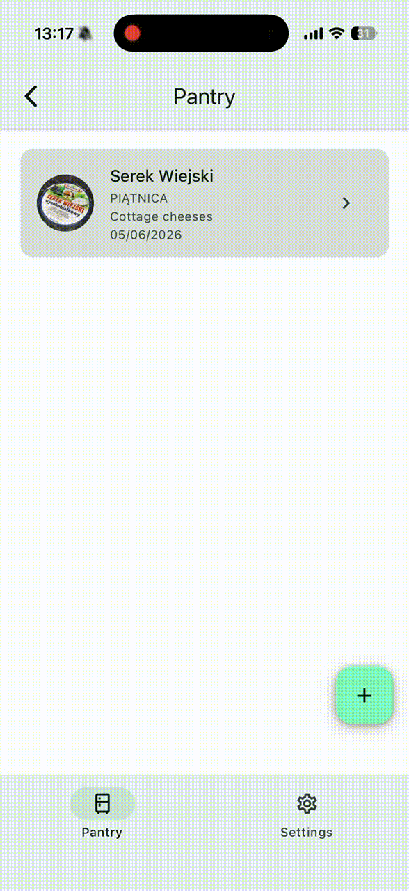
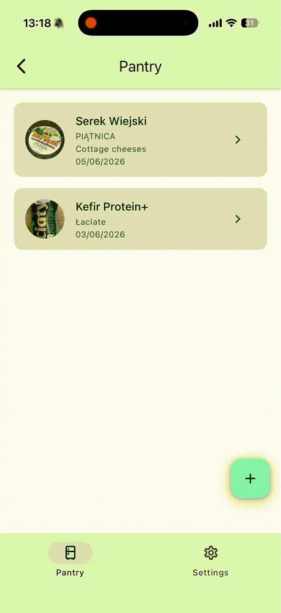

# Pantrly

Pantrly is an React Native pantry tracker that helps you add food items quickly, store their best-before dates, and keep a lightweight offline pantry on your device. The main flow is built around barcode scanning, but the app also supports manual entry and photo attachments for products that are not recognized automatically.

## What the app does

- Scans product barcodes with the device camera.
- Imports a barcode from an existing photo. (Android only)
- Looks up product metadata from the Open Food Facts API.
- Prefills item name, brand, categories, and image after a successful scan.
- Lets the user add pantry items manually when a barcode is missing or not found.
- Stores pantry items locally with AsyncStorage so the list persists between app launches.
- Supports editing existing items, changing dates, and clearing the pantry from settings.
- Caches selected product images locally for a more reliable offline detail view.

## Demo

### Scan flow



### Edit flow



### Fetch product by barcode



### Add product manually



## Tech stack

- React Native
- Expo
- Expo Router
- TypeScript
- React Native Paper
- TanStack React Store
- Jest + Testing Library
- Open Food Facts API for barcode/product lookup

## Project structure

```text
src/
  app/                Expo Router screens
  components/         Reusable UI building blocks
  api/                HTTP and product lookup helpers
  lib/store/          Pantry state management
  lib/storage/        AsyncStorage persistence
  lib/images/         Image picking and local image caching
  config/             API base URL and requested product fields
tests/                Unit and screen tests
```

## How to run?

### Prerequisites

- Node.js 20+
- `pnpm` installed globally
- One of:
  - Expo Go on a physical device
  - Android Studio emulator
  - Xcode simulator on macOS

### Quick start

```bash
pnpm install
pnpm dev
```

Then:

- Press `a` to open Android.
- Press `i` to open iOS on macOS.
- Or scan the QR code with Expo Go.

No `.env` file or local secret setup is required.

## Available scripts

```bash
pnpm dev      # start Expo dev server and clear cache
pnpm android  # open Android via Expo
pnpm ios      # open iOS via Expo
pnpm web      # run the web target
pnpm test     # run Jest tests
pnpm clean    # remove .expo and node_modules
```

## Product flow

1. The pantry tab lists stored items and exposes the two primary entry points: manual creation and scan.
2. The scanner screen reads barcodes with `expo-camera` and queries Open Food Facts.
3. The create screen lets the user review or complete metadata, set the best-before date, and attach an image.
4. The store persists pantry items with AsyncStorage and keeps image files available locally when possible.
5. The detail screen shows the saved item and links back into edit mode.

## Permissions used

- Camera: required for live barcode scanning and taking item photos.
- Photo library: required to import a barcode image or attach an existing product photo.

These permissions are already configured in `app.json`.

## API integration

Pantrly currently fetches product data from Open Food Facts:

- Base URL: `https://world.openfoodfacts.org/api/v2/product`
- Requested fields: barcode, product name, brands, category tags, front image, and comparison category data

The lookup flow is implemented in:

- `src/api/products.ts`
- `src/api/http.ts`
- `src/lib/mappers/productMapper.ts`
